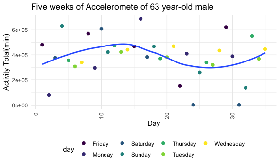
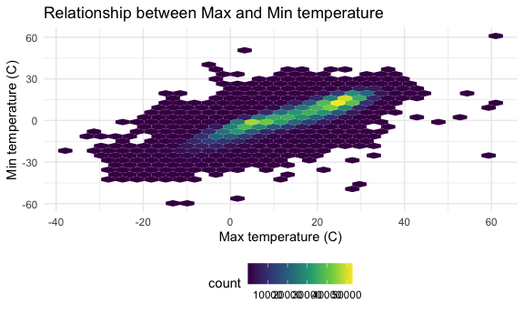
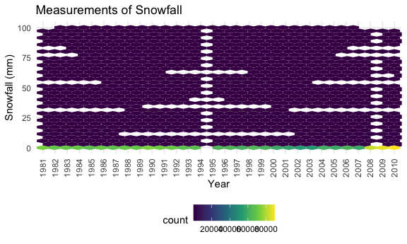

HW3
================
Juyoung Hahm
10/10/2020

# Problem 1

``` r
data("instacart")
```

This dataset contains 1384617 rows and … columns.

Observations are the level of items in orders by user. There are user /
order variables – user ID, order ID, order day, and order hour. There
are also item variables – name, aisle, department, and some numeric
codes.

How many aisles, and which are most items from?

``` r
instacart %>% 
    count(aisle) %>% 
    arrange(desc(n))
```

    ## # A tibble: 134 x 2
    ##    aisle                              n
    ##    <chr>                          <int>
    ##  1 fresh vegetables              150609
    ##  2 fresh fruits                  150473
    ##  3 packaged vegetables fruits     78493
    ##  4 yogurt                         55240
    ##  5 packaged cheese                41699
    ##  6 water seltzer sparkling water  36617
    ##  7 milk                           32644
    ##  8 chips pretzels                 31269
    ##  9 soy lactosefree                26240
    ## 10 bread                          23635
    ## # … with 124 more rows

Let’s make a plot that shows the number of items ordered in each aisle,
limiting this to aisles with more than 10000 items ordered

``` r
instacart %>% 
    count(aisle) %>% 
    filter(n > 10000) %>% 
    mutate(
        aisle = factor(aisle),
        aisle = fct_reorder(aisle, n)
    ) %>% 
    ggplot(aes(x = aisle, y = n)) + 
    geom_point() + 
    theme(axis.text.x = element_text(angle = 90, vjust = 0.5, hjust = 1))
```


Let’s make a table showing the three most popular items in each of the
aisles “baking ingredients”, “dog food care”, and “packaged vegetables
fruits”. Include the number of times each item is ordered in your table

``` r
instacart %>% 
    filter(aisle %in% c("baking ingredients", "dog food care", "packaged vegetables fruits")) %>% 
    group_by(aisle) %>% 
    count(product_name) %>% 
    mutate(rank = min_rank(desc(n))) %>% 
    filter(rank < 4) %>% 
    arrange(aisle, rank) %>% 
    knitr::kable()
```

| aisle                      | product\_name                                 |    n | rank |
| :------------------------- | :-------------------------------------------- | ---: | ---: |
| baking ingredients         | Light Brown Sugar                             |  499 |    1 |
| baking ingredients         | Pure Baking Soda                              |  387 |    2 |
| baking ingredients         | Cane Sugar                                    |  336 |    3 |
| dog food care              | Snack Sticks Chicken & Rice Recipe Dog Treats |   30 |    1 |
| dog food care              | Organix Chicken & Brown Rice Recipe           |   28 |    2 |
| dog food care              | Small Dog Biscuits                            |   26 |    3 |
| packaged vegetables fruits | Organic Baby Spinach                          | 9784 |    1 |
| packaged vegetables fruits | Organic Raspberries                           | 5546 |    2 |
| packaged vegetables fruits | Organic Blueberries                           | 4966 |    3 |

Make a table showing the mean hour of the day at which Pink Lady Apples
and Coffee Ice Cream are ordered on each day of the week

``` r
instacart %>% 
    filter(product_name %in% c("Pink Lady Apples", "Coffee Ice Cream")) %>% 
    group_by(product_name, order_dow) %>% 
    summarize(mean_hour = mean(order_hour_of_day)) %>% 
    pivot_wider(
        names_from = order_dow,
        values_from = mean_hour
    )
```

    ## `summarise()` regrouping output by 'product_name' (override with `.groups` argument)

    ## # A tibble: 2 x 8
    ## # Groups:   product_name [2]
    ##   product_name       `0`   `1`   `2`   `3`   `4`   `5`   `6`
    ##   <chr>            <dbl> <dbl> <dbl> <dbl> <dbl> <dbl> <dbl>
    ## 1 Coffee Ice Cream  13.8  14.3  15.4  15.3  15.2  12.3  13.8
    ## 2 Pink Lady Apples  13.4  11.4  11.7  14.2  11.6  12.8  11.9

# Problem 2

``` r
accel = read_csv("./accel_data.csv") %>%
  janitor::clean_names()
```

    ## Parsed with column specification:
    ## cols(
    ##   .default = col_double(),
    ##   day = col_character()
    ## )

    ## See spec(...) for full column specifications.

``` r
accel = accel %>%
  mutate(
    day = factor(day),
    week = factor(week),
    weekday_vs_weekend = ifelse(day %in% c("Saturday", "Sunday"), "W_end", "W_day"),
    weekday_vs_weekend = factor(weekday_vs_weekend)
  ) %>%
  select(
    week, day_id, day, weekday_vs_weekend, everything()
  ) 
```

After organizing the data set `accel`, there are total of 50540 data and
35 obsservations. In order to distinguish the weekdays and weekends,
`weekday_vs_weekend` was created. Since the variables `activity_1`
through `activity_1440` are activity counts for each minute of a 24-hour
day, it would be best to sum up them all and compare the total activity
time.

Next, we establish the new variable `total activity` to aggregate across
minutes for each day:

``` r
accel %>%
  mutate(activity_total = rowSums(accel[, 5:1444])) %>%
    arrange(desc(activity_total)) %>%
  select(
    week, day_id, weekday_vs_weekend, activity_total
  ) %>%

  knitr::kable()
```

| week | day\_id | weekday\_vs\_weekend | activity\_total |
| :--- | ------: | :------------------- | --------------: |
| 3    |      16 | W\_day               |       685910.00 |
| 1    |       4 | W\_end               |       631105.00 |
| 5    |      29 | W\_day               |       620860.00 |
| 2    |      10 | W\_end               |       607175.00 |
| 2    |       8 | W\_day               |       568839.00 |
| 5    |      33 | W\_day               |       549658.00 |
| 1    |       1 | W\_day               |       480542.62 |
| 2    |      12 | W\_day               |       474048.00 |
| 3    |      21 | W\_day               |       468869.00 |
| 3    |      15 | W\_day               |       467420.00 |
| 3    |      18 | W\_end               |       467052.00 |
| 5    |      35 | W\_day               |       445366.00 |
| 2    |      14 | W\_day               |       440962.00 |
| 4    |      28 | W\_day               |       434460.00 |
| 2    |      13 | W\_day               |       423245.00 |
| 2    |      11 | W\_end               |       422018.00 |
| 4    |      23 | W\_day               |       409450.00 |
| 5    |      30 | W\_day               |       389080.00 |
| 3    |      17 | W\_end               |       382928.00 |
| 3    |      20 | W\_day               |       381507.00 |
| 1    |       3 | W\_end               |       376254.00 |
| 3    |      19 | W\_day               |       371230.00 |
| 5    |      34 | W\_day               |       367824.00 |
| 1    |       5 | W\_day               |       355923.64 |
| 4    |      26 | W\_day               |       340291.00 |
| 1    |       7 | W\_day               |       340115.01 |
| 4    |      27 | W\_day               |       319568.00 |
| 1    |       6 | W\_day               |       307094.24 |
| 2    |       9 | W\_day               |       295431.00 |
| 4    |      25 | W\_end               |       260617.00 |
| 4    |      22 | W\_day               |       154049.00 |
| 5    |      32 | W\_end               |       138421.00 |
| 1    |       2 | W\_day               |        78828.07 |
| 4    |      24 | W\_end               |         1440.00 |
| 5    |      31 | W\_end               |         1440.00 |

Using the table, we cannot clearly see the trend, so we are going to
make a plot to see the evident trend.

To see the trend of the `activity_total`, we are going to plot the
24-hour activity time courses for each day, separated by the day of the
week:

``` r
accel %>%
  mutate(activity_total = rowSums(accel[, 5:1444])) %>%
  ggplot(aes(x = day_id, y = activity_total)) + 
  geom_point(aes(color = day), size = 2) +
  geom_smooth(se = FALSE) +
  theme(axis.text.x = element_text(angle = 90, vjust = 0.5, hjust = 1)) +
  labs(y = "Activity Total(min)", x = "Day", title = "Five weeks of Acceleromete of 63 year-old male")
```

    ## `geom_smooth()` using method = 'loess' and formula 'y ~ x'


Using this plot, it shows that there is a non parametric smooth trend.
Also, non parametric smooth trend provides a variation of different
variables. We can see Tuesday, Wednesday, Thursday has a steady trend,
but other days, Friday, Saturday, Sunday, and Monday has a fluctuating
trend.

# Problem 3

``` r
library(p8105.datasets)
data("ny_noaa")
```

Organize the data `ny_noaa`.

``` r
ny_noaa = ny_noaa %>%
  janitor::clean_names() %>%
  separate(date, c("year", "month", "day"), sep = "-") %>%
  mutate(
    month = as.numeric(month),
    tmax = as.numeric(as.character(tmax)),
    tmin = as.numeric(as.character(tmin)),
    prcp = as.numeric(prcp),
    snow = as.numeric(snow),
    snwd = as.numeric(snwd)
         ) %>%
  filter(prcp >= 0 | snow >= 0 | snwd >= 0 |  is.na(prcp) | is.na(snow) | is.na(snwd)
         )
ny_noaa = ny_noaa %>%
  mutate(
    tmax = tmax/10,
    tmin = tmin/10,
    prcp = prcp/10
  )
```

Separate the `date` into `year`, `month`, and `day` for future coding.
Let the units for `prcp`, `snow`, and `snwd` to be non-negative number
because having a negative unit is impossible. After changing the class
type of `tmax`, `tmin`, and `prcp`, divide by 10 because these are
measured in tenths.

``` r
ny_noaa %>% 
  select(year, month, snow) %>%
    count(snow) %>% 
  mutate(rank = min_rank(desc(n))) %>% 
    filter(rank <= 4) %>%
  knitr::kable()
```

| snow |       n | rank |
| ---: | ------: | ---: |
|    0 | 2008508 |    1 |
|   13 |   23095 |    4 |
|   25 |   31022 |    3 |
|   NA |  381221 |    2 |

We can see the most commonly observed values are: 0, NA, 31022, and
23095. There are almost 2 million zero millimeters of snowfall. One of
the factors of this frequency is that the temperature of the Earth
continues to rise, and therefore less snow is created.

To see this clear evidence, let’s compare the average max temperature
between January and July:

``` r
month_df = tibble(month = 1:12, month_name = month.name)
ny_noaa = left_join(ny_noaa, month_df, by = "month")
ny_noaa = ny_noaa %>%
  select(id, year, month_name, day, everything())

ny_noaa_Jan_Jul = ny_noaa %>% 
    filter(month_name %in% c("January", "July")) %>% 
    group_by(month_name, id, year) %>% 
    summarize(average_tmax = mean(tmax, na.rm = T))
```

    ## `summarise()` regrouping output by 'month_name', 'id' (override with `.groups` argument)

``` r
ggplot(ny_noaa_Jan_Jul, aes(x = year, y = average_tmax, group = id, color = id)) + 
  geom_point(alpha = .5, show.legend = F) +
  facet_grid(. ~ month_name) + 
  labs(title = "Mean average temperature for January and July across stations and years",
       x = "Year", y = "Average maximum temperature (C)") +
  theme(axis.text.x = element_text(angle = 90, vjust = 0.5, hjust = 1))
```


We compared average max temperatures of January and July. Looking at the
scatterplot, we can clearly see that the July average max temperatures
are higher than the January. As time passes, the average max temperature
of January is slowly getting higher, indicating the global warming is
processing. We can determine some outliers, such as one point in July,
where the temperature is about 15C.

To see the relationship between max and min temperature, we agre going
to graph hex graph:

``` r
ny_noaa %>%
  drop_na(tmax, tmin) %>%
  ggplot(aes(x = tmax, y = tmin)) + 
  geom_hex() +
  labs(title = "Relationship between Max and Min temperature", 
       x = "Max temperature (C)", y = "Min temperature (C)")
```



make a plot showing the distribution of snowfall values greater than 0
and less than 100 separately by year

``` r
ny_noaa %>%
  filter(snow >= 0 & snow <= 100) %>%
  drop_na(snow) %>%
  ggplot(aes(x = year, y = snow)) + 
  geom_hex() +
  labs(title = "Measurements of Snowfall", x = "Year", y = "Snowfall (mm)") +
  theme(axis.text.x = element_text(angle = 90, vjust = 0.5, hjust = 1))
```



The size of this data, `ny_noaa` has 25951760. `ny_noaa` is a data set
that for each Weather station ID, precipitation, snowfall, snow depth,
maximum and minimum temperature was recorded everyday. Some of the key
variables are `snow` and `tmin` because these variables are the
indications that the Earth is getting warmer. We can notice that there
are a lot of NAs and this could lead to an misleading conclusion. For
example, the NAs in `tmax` and `tmin` contains more than half. So, we
cannot accurately compare the average temperatures.
